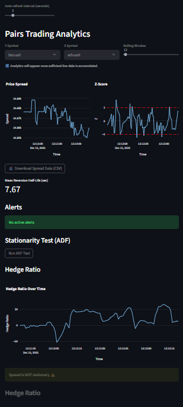
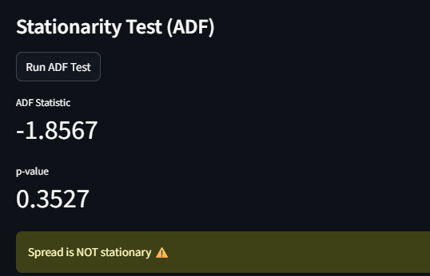

# 📊 Real-Time Pairs Trading Analytics Platform

This project is a **real-time quantitative analytics system** built as part of the **Gemscap assignment**. It ingests live cryptocurrency market data from Binance, performs statistical analysis for pairs trading, and visualizes insights through an interactive dashboard.

The focus of this assignment is **data engineering, backend systems, statistical analysis, and DevOps awareness** rather than trading execution.

---

## Output





---

## 🚀 What This Project Does (High Level)

- Consumes **real-time BTC/USDT and ETH/USDT trade data** from Binance
- Stores live tick data in memory
- Resamples asynchronous ticks into aligned time-series
- Computes **pairs trading metrics** such as:
  - Hedge Ratio
  - Spread
  - Z-Score
  - Stationarity (ADF Test)
  - Mean Reversion Half-Life
- Displays results in a **real-time Streamlit dashboard**
- Uses **Redis** as a hot cache for analytics
- Fully **Dockerized** using Docker Compose

---

## 🧠 Why BTCUSDT & ETHUSDT?

- `BTCUSDT` = Price of Bitcoin in US Dollars
- `ETHUSDT` = Price of Ethereum in US Dollars

Bitcoin and Ethereum are **highly correlated assets**, making them a classic example for demonstrating **pairs trading and mean-reversion analysis**.

---

## 📈 Core Concepts Explained (Layman Friendly)

### 1️⃣ Hedge Ratio

- Shows **how much ETH typically moves when BTC moves**
- Used to scale prices so both assets are comparable
- Computed using rolling linear regression

**Why it matters:**
Ensures spread calculation is statistically meaningful

---

### 2️⃣ Spread

```
Spread = BTC_price − (hedge_ratio × ETH_price)
```

- Measures the **distance between BTC and ETH prices**
- This is the primary signal used in pairs trading

---

### 3️⃣ Z-Score

- Measures **how extreme the current spread is** compared to its historical average
- Z-score thresholds (±2) are used for alerts

**Interpretation:**
- Z ≈ 0 → Normal
- |Z| > 2 → Unusually high or low (potential opportunity)

---

### 4️⃣ Stationarity (ADF Test)

- Uses the **Augmented Dickey-Fuller test**
- Checks whether the spread is **mean-reverting**

**Rule:**
- p-value < 0.05 → Stationary (good for pairs trading)
- p-value ≥ 0.05 → Not stationary

---

### 5️⃣ Mean Reversion Half-Life

- Estimates **how quickly the spread returns to its mean**
- Lower half-life = faster mean reversion

---

## 📊 Dashboard Features

- Live spread chart
- Z-score chart with alert thresholds
- Rolling hedge ratio chart
- ADF test results with interpretation
- Mean reversion half-life metric
- CSV export of analytics
- Auto-refresh interval control

---

## 🧱 Tech Stack

### Backend
- **Python 3.10+**
- **FastAPI** (API layer)
- **Async WebSockets** (Binance data ingestion)
- **Pandas / NumPy** (time-series processing)
- **Statsmodels** (ADF test)
- **DuckDB** (analytics-ready storage)
- **Redis** (hot cache)

### Frontend
- **Streamlit** (interactive UI)
- **Plotly** (charts & visualizations)

### DevOps
- **Docker**
- **Docker Compose**
- **Redis official image**

---

## 🗂️ Project Structure

```
gemscap-quant-app/
├── app/
│   ├── main.py
│   ├── api/routes.py
│   ├── analytics/
│   ├── ingestion/
│   └── cache/
├── frontend/
│   ├── dashboard.py
│   ├── Dockerfile
│   └── requirements.txt
├── Dockerfile
├── docker-compose.yml
├── requirements.txt
└── README.md
```

---

## ⚙️ Setup & Dependencies

### Prerequisites
- Docker & Docker Compose
- Python 3.10+ (for local development)

### Backend Dependencies
- FastAPI
- WebSockets (Binance ingestion)
- Pandas, NumPy
- Statsmodels (ADF test)
- DuckDB
- Redis (caching)

### Frontend Dependencies
- Streamlit
- Plotly
- Requests

Dependencies are separated for backend and frontend using individual `requirements.txt` files.

---

## 🧪 Methodology

1. **Data Ingestion**  
   Live trade data for BTCUSDT and ETHUSDT is ingested from Binance WebSocket streams.

2. **Data Storage**  
   Incoming ticks are stored temporarily in an in-memory buffer for real-time processing.

3. **Resampling & Alignment**  
   As trades occur asynchronously, tick data is resampled into fixed 1-second intervals and aligned before analysis.

4. **Analytics Computation**  
   - Hedge Ratio via rolling regression  
   - Spread calculation  
   - Z-score normalization  
   - Stationarity testing using ADF  
   - Mean reversion half-life estimation

5. **Caching**  
   Redis is used as a hot cache to reduce recomputation and improve response times.

6. **Visualization & Alerts**  
   Analytics are served via FastAPI and visualized in Streamlit. Z-score thresholds trigger alerts.

---

## 📊 Analytics Explained (Simple Terms)

- **Hedge Ratio:** How much ETH typically moves when BTC moves
- **Spread:** Difference between BTC and scaled ETH prices
- **Z-score:** How extreme the spread is compared to its normal range
- **ADF Test:** Checks if spread naturally returns to its mean (stationary)
- **Half-Life:** How fast the spread reverts back to normal

---

## ▶️ How to Run (Docker Recommended)

```bash
docker compose up --build
```

### Access URLs

- Backend API Docs: http://localhost:8000/docs
- Frontend Dashboard: http://localhost:8501

---

## 🤖 AI / LLM Usage Transparency

Large Language Models (ChatGPT) were used as a **development assistant** for:
- Understanding quantitative finance concepts
- Structuring backend architecture
- Debugging integration issues
- Improving documentation clarity

All design decisions, implementation, and testing were performed by the author. AI tools were used only for guidance and clarification, not for direct code generation without understanding.

---

## 🏗️ Architecture Diagram

The system architecture includes:
- Binance WebSocket ingestion
- In-memory tick buffer
- Analytics engine
- Redis cache
- FastAPI backend
- Streamlit frontend
- Alerting flow

An architecture diagram has been created using **draw.io**.

Included files:
- `architecture.drawio` (source)
- `architecture.png` (exported diagram)

---

## 🔍 Debug Endpoints

- `/ticks/{symbol}` → Inspect recent raw ticks
- `/analytics/spread` → Spread & Z-score data
- `/analytics/adf` → Stationarity test
- `/alert/zscore` → Z-score alerts

---

## 🧪 Notes & Assumptions

- Tick data is stored **in-memory** for simplicity
- Resampling is required because trades occur asynchronously
- Redis cache TTL is short to support near real-time updates
- This project focuses on **analytics**, not live trading execution

---

## 🎯 What This Demonstrates

- Real-time data ingestion
- Time-series alignment & resampling
- Statistical modeling
- Clean backend architecture
- DevOps & containerization awareness

---

## 📌 Final Note

This project is intentionally designed to balance **quantitative analysis** and **software engineering best practices**, aligning with the expectations of a **Quant / Backend / Platform Engineering role**.

---

**Author:** Kumar Nandwalkar

