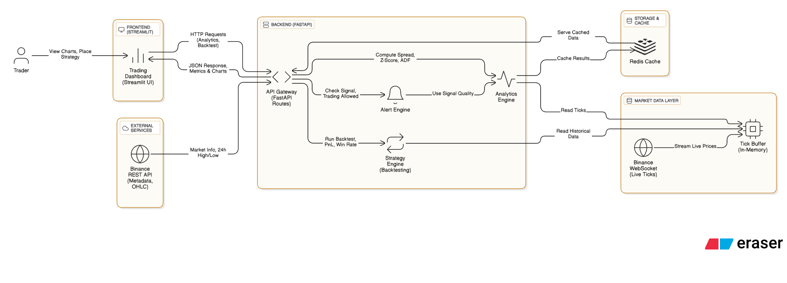
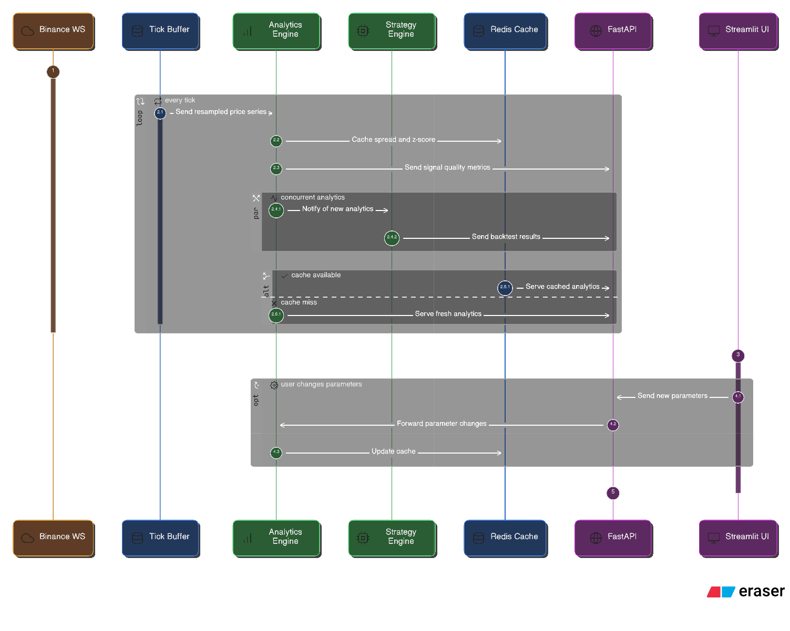
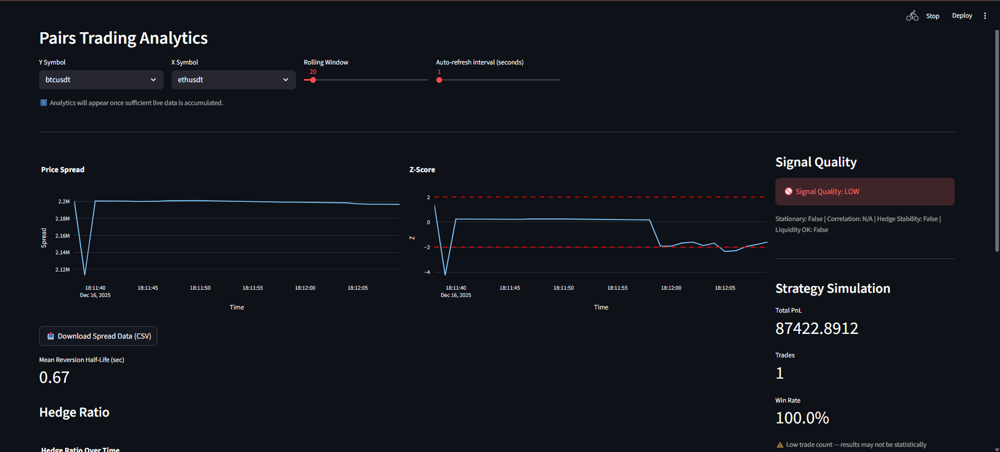
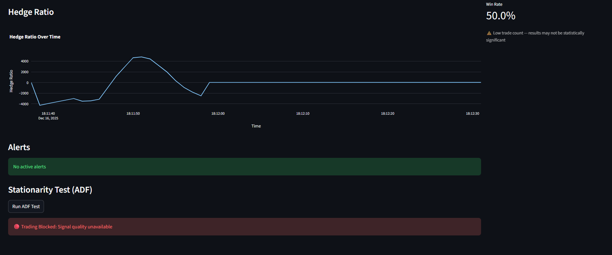
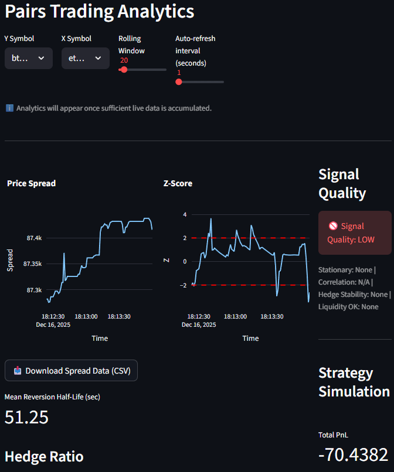

# 📈 Pairs Trading Analytics Platform

A real-time quantitative trading analytics platform built as part of the **Gemscap Quant Developer Assessment**. The system ingests live cryptocurrency market data from Binance, performs statistical arbitrage (pairs trading) analytics, and visualizes actionable insights through an interactive dashboard.

---

## 🔧 Tech Stack

### Backend

- **Python + FastAPI** – Simple, fast APIs to serve analytics in real time
- **Binance WebSocket API** – Live crypto price & volume data directly from the exchange
- **Pandas / NumPy** – Easy-to-use tools for time‑series calculations
- **Statsmodels** – Reliable statistical testing (ADF)
- **Redis** – Fast in‑memory cache to avoid recomputing analytics

### Frontend

- **Streamlit** – Quickly build an interactive trading-style dashboard without heavy UI code
- **Plotly** – Clear, interactive charts similar to trading platforms

### DevOps

- **Docker & Docker Compose** – Run the entire system (backend, cache, UI) with one command
- **Redis** – Shared cache layer across services

---

## 🧩 Key Design Decisions

- **FastAPI**: Lightweight and fast, ideal for real‑time analytics APIs
- **Streamlit**: Chosen to focus on trading logic instead of frontend boilerplate
- **Binance WebSocket**: Real‑time data instead of delayed REST snapshots
- **Redis caching**: Keeps analytics responsive even as data volume grows
- **Single‑screen dashboard**: Matches how real traders consume information

---

## 🧠 System Architecture

The system is designed as a real-time streaming analytics pipeline:

1. **Data Ingestion**  \
   Binance WebSocket streams live price and volume updates.

2. **In-Memory Buffer**  \
   Recent ticks are stored temporarily for fast analytics access.

3. **Analytics Engine**  \
   Computes spread, z‑score, hedge ratio, stationarity, half‑life, and signal quality.

4. **Redis Cache**  \
   Stores recent analytics results to reduce recomputation and latency.

5. **FastAPI Backend**  \
   Serves analytics, alerts, and backtest results via APIs.

6. **Streamlit Frontend**  \
   Displays charts, metrics, alerts, and strategy simulation.

7. **Docker Runtime**  \
   Orchestrates backend, Redis, and frontend as isolated services.

---

## System Architecture and Data Flow






---

## 📊 Analytics Explained (Layman-Friendly)

### 🔹 Trading Pair (BTCUSDT & ETHUSDT)

- Prices of Bitcoin and Ethereum quoted in USDT (a dollar‑like stablecoin).
- These assets often move together, making them suitable for comparison.

### 🔹 Spread

- The price difference between two related assets.
- Traders expect this gap to widen and shrink repeatedly.

### 🔹 Hedge Ratio

- Tells how much of one asset offsets the risk of the other.
- Stable ratio means the relationship is trustworthy.

### 🔹 Z-Score

- Shows how "unusual" the current spread is compared to the past.
- Extreme values suggest possible buy/sell opportunities.

### 🔹 ADF Test (Stationarity)

- Checks whether the spread naturally returns to its average.
- If yes, the strategy is statistically meaningful.

### 🔹 Mean Reversion Half-Life

- How quickly the spread tends to normalize.
- Shorter half‑life means faster potential trades.

### 🔹 Signal Quality

- A simplified confidence score for traders.
- Combines stability, correlation, hedge reliability, and liquidity.

### 🔹 Strategy Simulation

- Tests the strategy on recent data without real money.
- Helps traders understand risk, consistency, and potential profitability.

**Real‑world impact:** prevents blindly trading untested strategies.

---

## 🧪 Strategy Simulation

A simple mean-reversion backtest is implemented:

- Entry: Z-score exceeds threshold
- Exit: Z-score reverts to mean

Displayed Metrics:

- Total Profit and Loss metrics
- Number of trades
- Win rate / Profitability 

⚠️ Results are indicative, not investment advice.

---

## 🚀 Setup Instructions

### Prerequisites

- Docker & Docker Compose
- Python 3.10+

### Run with Docker

**Run from project root directory:**

```bash
docker-compose up --build
```

Services started:

- FastAPI backend (port 8000)
- Redis cache (port 6379)
- Streamlit frontend

### Run Locally (without Docker)

**Run from project root directory:**

```bash
# Backend
uvicorn app.main:app --reload

# Frontend
streamlit run frontend/dashboard.py
```
```

---

## 📁 Project Structure

```text
app/
 ├── ingestion/        # Binance WebSocket
 ├── analytics/        # Quant models
 ├── cache/            # Redis client
 ├── routes.py         # API routes
frontend/
 ├── dashboard.py      # Streamlit UI
docker-compose.yml
Dockerfile
README.md
```

---

## 🤖 AI Usage Transparency

AI tools (primarily ChatGPT) were used as a **development assistant**,  The usage was focused on accelerating debugging, and system design decisions.

**Where AI was used:**

- **Frontend development (Streamlit)**: Designing dashboard layout, metrics placement, charts, and user flow similar to trading platforms.
- **System design & architecture**: Planning backend–frontend separation, data flow, and caching strategy.
- **Debugging & error resolution**: Understanding runtime errors, stack traces, and API failures.
- **Code refinement**: Improving analytics functions, API robustness, and UI stability.
- **DevOps guidance**: Docker, docker‑compose, Redis integration, and environment configuration.
- **Documentation support**: Structuring README and explaining analytics clearly.


AI tools (ChatGPT / GPT-4, Gemini) were used for:

- Code scaffolding
- Error debugging
- Improving code readability
- Documentation drafting

---

## Output





## 👤 Author

**Kumar Nandwalkar**\
Final-year Electronics & Telecommunication Engineering Student\
VIT Pune
